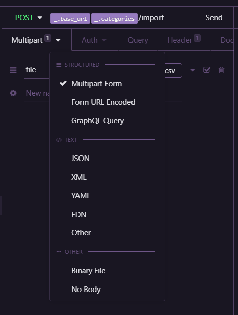
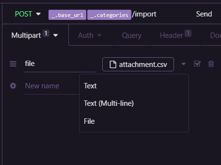
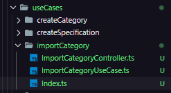

# Upload de arquivos com MULTER e leitura de dados

(Obs: Não esta sendo utilizado banco de dados)

Aqui estará sendo apresentado o modo de instalação e utilização do multer para upload de arquivos.

Esses passos são apenas realizados assim que todo o projeto já estiver criado e pronto para receber o multer e suas configuração, assim evita-se maiores dificuldades.

## Instalação

Começamos importando ele para o projeto com: 
```SH
yarn add multer 

yarn add @types/multer -D
```
Não utilizaremos como Dependencia de desenvolvimento pois o mesmo será necessario para que os usuarios efetuem o upload durante a utilização real do projeto. No caso apenas as tipagens serão utilizadas no ambiente de desenvolvimento mas são irrelevantes no ambiente de produção.

## Utilização

No caso esteremos utilizando ele direto em uma rota de Categories (categories.routes.ts).
- Criamos uma pasta para armazenamento temporario na raiz do projeto (tmp)
- Realizamos o import e a configuração básisca 
```JS
import multer from 'multer';

const upload = multer({
  dest: './tmp',
});
```
- Aplicamos a constante upload que funcionará como um Middleware na rota
```JS
categoriesRoutes.post('/import', upload.single('file'), (request, response) => {
  const { file } = request;
  console.log(file);
  return response.send();
});
```
Na rota acima foi declarado ` upload.single('file') `, pois passamos o `single` informando que será enviado apenas um arquivo com o nome de `file`, que será reconhecido pelo Insomnia(ambiente de teste utilizado). 

A utilização no Isnomnia é simples, ao passarmos a rota precisamos utilizar o modo Multipart Form para passarmos o arquivo.

- Arquivo utilizado:   [Attachment](./AuxArchive/attachment.csv)





Para que possamos verificar se tudo funcionou, utilizamos o `console.log(file)` para identificar se realmente recebemos o arquivos e caso tudo tenha saido da maneira correta recebemos: 
``` SH
{
  fieldname: 'file',
  originalname: 'attachment.csv',
  encoding: '7bit',
  mimetype: 'text/csv',
  destination: './tmp',
  filename: '3a2709f03aaa3a5fb7066d4bf2285dfc',
  path: 'tmp\\3a2709f03aaa3a5fb7066d4bf2285dfc',
  size: 78
}
```
E o arquvio ja se encontra dentro da pasta que criamos chama `tmp`.

# Importando dados do arquivo

O arquivo adicionado será lido e utilizado para adicionar dados na nossa base de dados de forma mais eficiente para isso criamos um UseCase de importações:

- Criamos o nosso UseCase para as importações dos dados do arquivo com a mesma estrutura de arquivo dos demais UseCases.



- [UseCase](./src/modules/cars/useCases/importCategory/ImportCategoryUseCase.ts)

- [Controller](./src/modules/cars/useCases/importCategory/ImportCategoryController.ts)

- [Index](./src/modules/cars/useCases/importCategory/Index.ts)

Para avançarmos na leitura, utilizaremos o conteito de `stream` com um módulo nativo do Node - `File System`

- Instalamos a biblioteca: `yarn add csv-parse` e realizamos a importação
- Utilizamos o csv-parse para realizar a leitura linha por linha do arquivo
```JS
class ImportCategoryUseCase {
  execute(file: Express.Multer.File): void {
    const stream = fs.createReadStream(file.path);

    const parseFile = csvParse();

    stream.pipe(parseFile);

    parseFile.on('data', async (line) => {
      console.log(line);
    });
  }
}
```

Caso tudo ocorra da maneira certo você terá como resultado:
```SH
[ 'SUV', 'Utilitário esportivo' ]
[ 'Sedan', 'Automóvel de três volumes' ]
[ 'Hatch', 'Carro curto' ]
```
